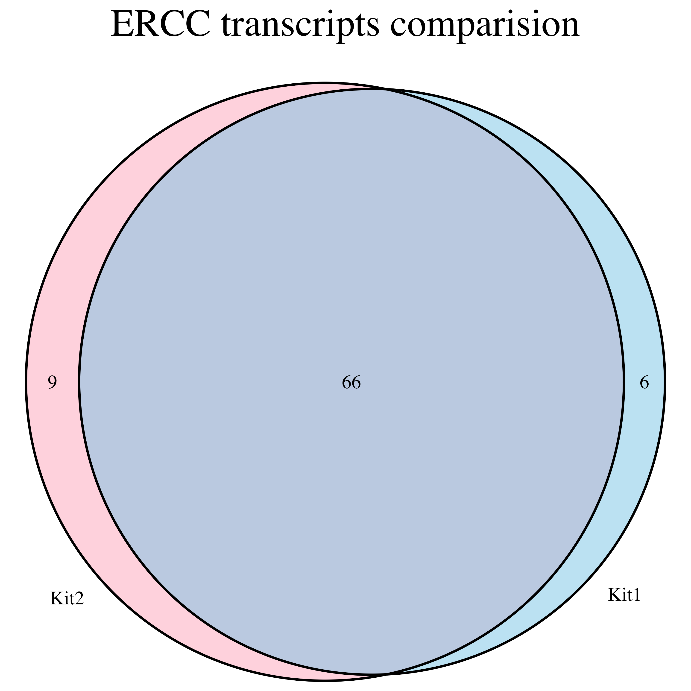
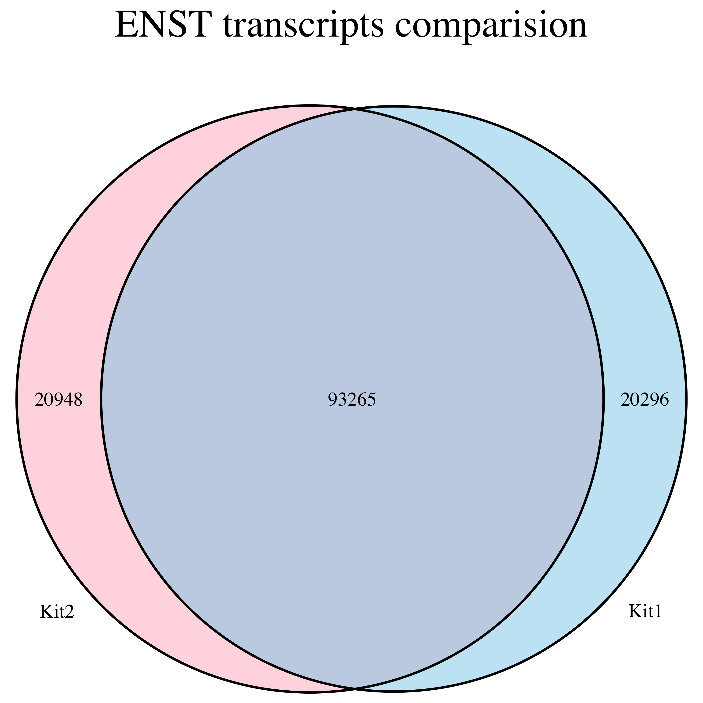

## Get the data ready and set R environment
Get the quant files generated by salmon for two kits in a directory and set the path
```{r}
setwd("~/brad/kit-compare")
dir(pattern="*.sf")

#
#
#load libraries
library(reshape2)
library(ggplot2)
library(psych)
library(VennDiagram)
```

### Read both quant files and merge them
```{r}
# Read quant files as table
kit1<-read.table(file="kit1.quant.sf",header=T,sep="\t",comment.char = "",stringsAsFactors = FALSE)
kit2<-read.table(file="kit2.quant.sf",header=T,sep="\t",comment.char = "",stringsAsFactors = FALSE)

# Merge information from both kits
kit_both <- merge(kit1, kit2, by.x="Name", by.y="Name")

# Change column names
colnames(kit_both) <- c("Name","Length.kit1","EffectiveLength.kit1","TPM.kit1","NumReads.kit1","Length.kit2","EffectiveLength.kit2","TPM.kit2","NumReads.kit2")

#Mark control ERCC fragment in new column "type"
kit_both$type = ifelse(grepl("ENST",kit_both$Name),"ENST","ERCC")

# Split both kits data into ENST and ERCC i.e seperate data frame for exploration
kit_both_enst <- kit_both[kit_both$type == "ENST",]
kit_both_ercc <- kit_both[kit_both$type == "ERCC",]
```

## Check data distribution
#### Boxplot
Check the distribution of TPM for both kits w.r.t type
```{r}
test_data <- melt(kit_both[,grepl("TPM|type",colnames(kit_both_ercc))],value.name="TPM")
#convert to log as data has extreme outliers
test_data$TPM = log(test_data$TPM )

# draw boxplot
ggplot(test_data, aes(type,TPM,fill=variable)) +
 geom_boxplot() 
```

The log converted distribution seems similar and comparable for both kits, however outliers (low level transcrjipts) are seen on both kits. Slightly higher median was oberved for kit2.

#### Histograms 

```{r}
# draw density plot limiting the extreme ends 
ggplot(test_data,aes(x=TPM,fill=variable)) +
  geom_histogram(alpha=.5,bins = 100,position="identity")  +
  scale_x_continuous(limits = c(-5, 5))

```

The histograms looks very similar for both kits but It seems that kit1 has more transcripts with lower TMP (log(TPM) <1) and vice versa.


## Checking for kit sensitivity
For ERCC and ENST we can check how many transcript are detected i.e have TPM greater than cutoff (currently set as zero).

**Checking for ERCC first which has 92 transcripts as control Mix**
```{r}
Cutoff <- 0
kit1 <- kit_both_ercc[kit_both_ercc$TPM.kit1 > Cutoff,c("Name")]
kit2 <- kit_both_ercc[kit_both_ercc$TPM.kit2 > Cutoff,c("Name")]

venn.diagram(x=list("Kit1"=kit1,"Kit2"=kit2),filename="ercc.png",imagetype="png",fill = c("skyblue", "pink1"),scaled = TRUE,main="ERCC transcripts comparision",main.cex=2)
```
<div style="width:500px; height=500px">

</div>

**Checking for sensitivity of ENST transcripts**
```{r}
Cutoff <- 0
kit1 <- kit_both_enst[kit_both_enst$TPM.kit1 > Cutoff,c("Name")]
kit2 <- kit_both_enst[kit_both_enst$TPM.kit2 > Cutoff,c("Name")]

venn.diagram(x=list("Kit1"=kit1,"Kit2"=kit2),filename="enst.png",imagetype="png",fill = c("skyblue", "pink1"),scaled = TRUE, main="ENST transcripts comparision",main.cex=2)
```
<div style="width:500px; height=500px">

</div>

From ERCC and ENST venn diagram it becomes clear that kit2 is slightly more sensitive in detecting transcripts. Kit2 detected 3 more transcript in ERCC and 652 more in ENST compared to kit1. However, the Venn diagram also suggests that the kits are mutually exclusive in detecting transcripts i.e. each kit is missing around 10-20% transcript which is detected in other second kit and vice versa. A scatterplot presented next reveals more relations among the TPM of both kits.

## Comparing distribution of TPM on both kits
A red dotted line representing perfect correlation is added for comparision. Here we draw scatter plot between abundance of kit1 and kit2. Converting TPM values to log.
```{r}
ggplot(kit_both, aes(log(TPM.kit1),log(TPM.kit2))) +
  geom_point(size=0.1) + 
  geom_smooth() +
  facet_grid(. ~ type) +
  #scale_x_continuous(limits = c(-3, 3)) +
  #scale_y_continuous(limits = c(-3, 3)) +
  geom_abline(intercept = 0, slope = 1, linetype = "dashed",color="red") +
  theme(aspect.ratio = 1)
```

Here we can see the correlation pattern of TPM (for both kits) is not uniform and varies based on their TPM levels. This figure explains the discrepencies we saw in the venn diagram. For higher expressed transcripts the correlation seems good but for lower expressed genes there is quite a variation.

* Strong correlation was seen for transcripts with log(TPM) > 1 .
* The black line (made by dots) on the edges represent transcripts present in one kit but missing from other and vice-versa. The abundance level of these transcripts goes levels goes upto 4-5 measured in log(TPM).
* For transcripts with log(TPM) < 0 in any sample, weak correlations were detected.

We can also check the abundance distribution of transcripts detected in one kit but missing in other.
```{r}
# Detected in kit1 but not in kit2
kit1_exclusive = kit_both_enst[kit_both_enst$TPM.kit1 > Cutoff & kit_both_enst$TPM.kit2 == Cutoff,]
# Detected in kit2 but not in kit1
kit2_exclusive = kit_both_enst[kit_both_enst$TPM.kit2 > Cutoff & kit_both_enst$TPM.kit1 == Cutoff,]

ggplot(kit1_exclusive,aes(log(TPM.kit1))) +
  geom_histogram(alpha=.5,bins = 100,position="identity") +
  ggtitle("Kit1 exclusive transcripts abundance")

ggplot(kit2_exclusive,aes(log(TPM.kit2))) +
  geom_histogram(alpha=.5,bins = 100,position="identity") +
  ggtitle("Kit2 exclusive transcripts abundance")
```

From the distribution it seems that most 70-80% transcripts have low TPM values are missing from kits which might represent their limits of detection. However, some transcripts having large TPM are also missing from both kits. It will be good to check if the missing transcripts have any sequence/length specific properties.

## Cumulative counts of TPM
http://stackoverflow.com/questions/18379933/plotting-cumulative-counts-in-ggplot2
```{r}
test_data <- melt(kit_both[,grepl("TPM",colnames(kit_both_ercc))],value.name="TPM")
ggplot(test_data,aes(x=log(TPM ),color=variable)) +
  stat_bin(data=subset(test_data,variable=="TPM.kit1"),aes(y=cumsum(..count..)),bins=100,geom="step") +
  stat_bin(data=subset(test_data,variable=="TPM.kit2"),aes(y=cumsum(..count..)),bins=100,geom="step")+
  ggtitle("TPM vs count of transcripts having that TPM")
```

* kit1 has relatively higher low expressed transcript than kit2 (but maybe missed some high expressed transcript)
* kit2 has detected overall more transcripts.

## Comparing correlation with ERCC (Exploratory with assumption)
I wanted to compare the correlation of expressed transcripts with the ERCC controls. Without actual knowledge of the controls (specially the Mix type used) its difficult but I tried to make some guesses.
I was able to find the abundance of transcripts in ERCC sample from this link below.
https://tools.thermofisher.com/content/sfs/manuals/cms_095046.txt

```{r}
Ercc_control<-read.table(file="cms_095046.txt",header=T,sep="\t",comment.char = "",stringsAsFactors = FALSE)

# select dataset
Ercc_control2<-Ercc_control[,c("ERCC.ID","concentration.in.Mix.1..attomoles.ul.","concentration.in.Mix.2..attomoles.ul.")]
# Change column names
colnames(Ercc_control2) <- c("ID","Mix1","Mix2")
#Ercc_control2 <- Ercc_control2[order(Ercc_control2$ID),]
Ercc_expressed <- kit_both_ercc[,c("TPM.kit1","TPM.kit2","Name")]

# Merge the mis concentration alognwith transcript abundance
Ercc_all <- merge(Ercc_control2,Ercc_expressed,by.x="ID",by.y="Name")
```

Based on correlation we can try to predict which Mix was used (Mix1 or Mix2). To do so, we measure correlation using 66 transcripts expressed in both kits and convert them to log
```{r}
Ercc_66 <- Ercc_all[Ercc_all$TPM.kit1 > 0 & Ercc_all$TPM.kit2 > 0,]
row.names(Ercc_66) <- Ercc_66$ID
Ercc_66$ID <- NULL
Ercc_66_log <- log(Ercc_66)

# Use pairs.panel function from psych package
pairs.panels(Ercc_66_log)
```

It seems like Mix1 is used in both kits based on higher correlation with both kits. If thats true, we can check the properties of undetected transcripts (abundance here) .
I mark the transcripts in four categories based on their detection by both kits. The four categories are Miss_kit1,Miss_kit2,Missed_both,Present_both.

```{r}
Ercc_all_tmp <- Ercc_all
Ercc_all_tmp$status <- "Present_both"
Ercc_all_tmp$status <- ifelse(Ercc_all_tmp$TPM.kit1 == 0,"Miss_kit1",Ercc_all_tmp$status)
Ercc_all_tmp$status <- ifelse(Ercc_all_tmp$TPM.kit2 == 0,"Miss_kit2",Ercc_all_tmp$status)
Ercc_all_tmp$status <- ifelse(Ercc_all_tmp$TPM.kit1 == 0 & Ercc_all_tmp$TPM.kit2 == 0,"Missed_both",Ercc_all_tmp$status)

table(Ercc_all_tmp$status)
# This matches the result we got from venn diagram
```
```{r}
#The plot below is one dimensional pot but scattered using ID and colored them by status. 
ggplot(Ercc_all_tmp, aes(ID,log(Mix1),color=status)) +
geom_point(size=3) + 
theme(aspect.ratio = 1)
```

Here the plot shows that the ERCC transcripts (assuming Mix1 was used) that were missed in both kits are the low abundunt ones.
The kit2 detected all transcripts above log(Mix1) >0 , whereas kit 1 missed one. 


### Comments

* Using Salmon for transcript abundance, kit2 had 6% higher alignment rate.
* Here I analysed only TPM values produced by Salmon. Other attributes can be explored too.
* The TPM values for both kits and their distribution looks similar. Kit2 is slightly more sensitive in detecting transcripts.
* The correlation plot and venn diagram of transcripts abundunce by both kits shows that  boths kits missed 10-20% of at lower abundunt transcripts. However they also miss small proportion of high abundunt transcripts.
* For ERCC control, low abundunt transcripts were missing from both kits, kit2 had slightly better sensitivity.
* For ERCC control,If Mix1 was used, kit1 shows correlation of 97% whereas kit2 shows 96% based on commonly identified transcripts.

### Future explorations

For future explorations I would consider a few things 

* Check whether QC filtering on RNAseq rawdata improves alignemnt percentage.
* I would explore the reasons behind transcripts which are not detected by both kit. I would check if any correlation exists with transcript length and sequence properties (GC etc) of transcripts. 
* For accuracy of the kits, the variance/SD can be measured from the ERCC control transcripts which has same concentration.
* Its good Measuring fold change accuracy for kit1 and kit2 using the two Mix for ERCC.
* Having replicates in these experiments is suggested to show how reproducible the results are in terms of sensitivity, accuracy and fold change.

-----  

*****  


